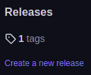
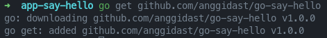
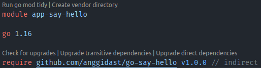

# Go Modules

Go Modules is library or dependency management

## Create a Module

To create a new module use command:
```bash
go mod init module-name
```

## Release a Module

Go has great integration with Git, to release a module we only need to create Git Tag.

## Create First Module

On this lesson, before create a new module we need to create a GitHub repository to store our released module

The module name is repository link

To create a new module use command:
```bash
go mod init github.com/anggidast/go-say-hello
```

After create a new module, Go will automatically create a new file: `go.mod`

Create a new file as a module,

`sayHello.go`

```go
package go_say_hello

func SayHello() string { // Capitalize to set function as public
	return "Hello"
}
```

After create a module file, push it to GitHub

To release module version, create Git tag on created module

```bash
git tag v1.0.0
git push origin v1.0.0
```

The module will have releases tag



## Add Dependency

We can add our released module to another module as dependency/library

```bash
go get module-name
```

Go will automatically download the dependency and add it to new module

Init new module and create a new main.go file as new module

add the dependecy with command above



after add dependecy, go mod file will listed the added dependency



Import dependency:

```go
package main

import (
	"fmt"

	go_say_hello "github.com/anggidast/go-say-hello"
)

func main() {
	fmt.Println(go_say_hello.SayHello())
}
```

## Upgrade Module

To upgrade module, add new Git tag to released module, and push it to GitHub

Change the version every update make

## Upgrade Dependency

Manually upgrade:

- Change dependency version at go.mod

- Use command `go get` to download new version
